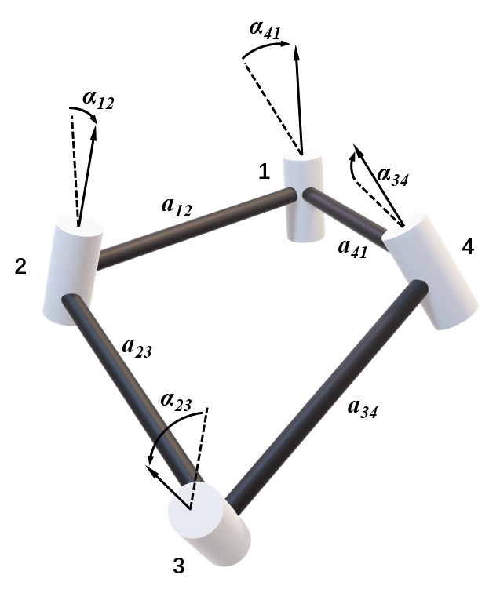
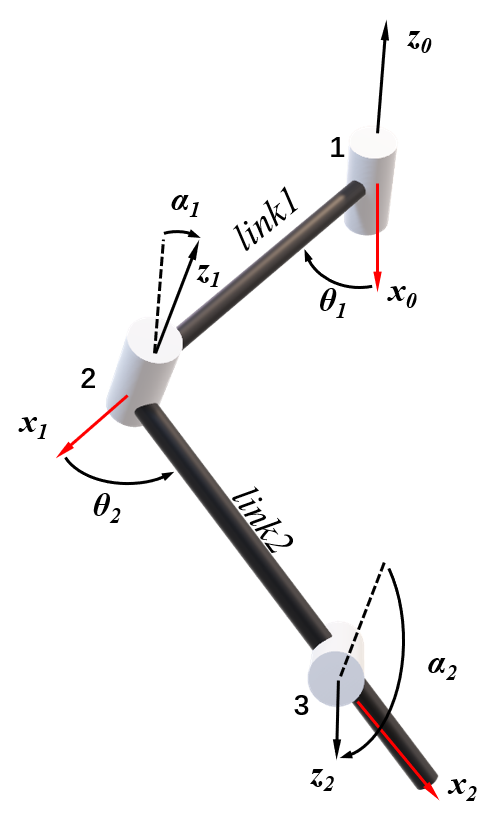
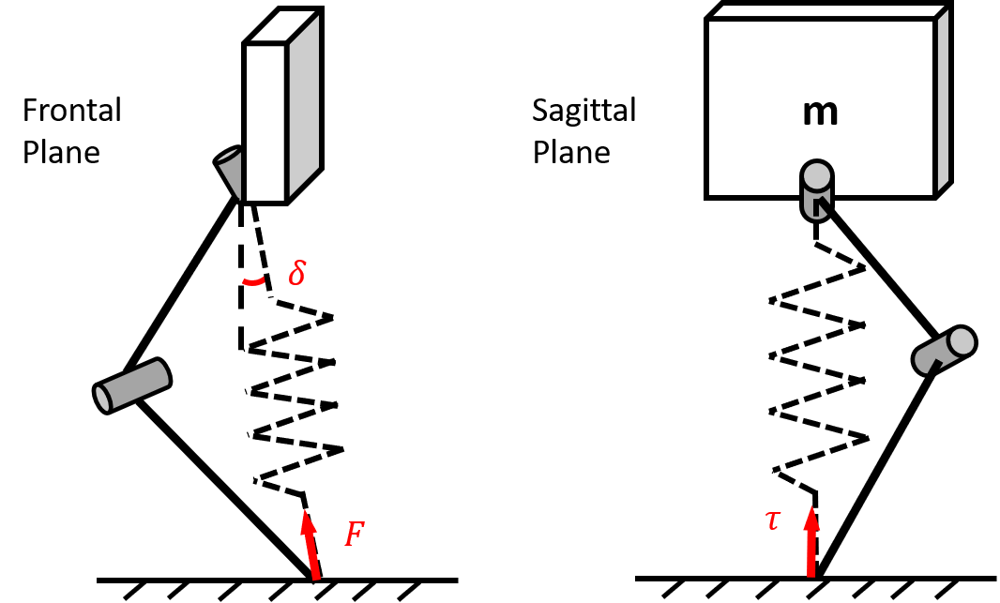
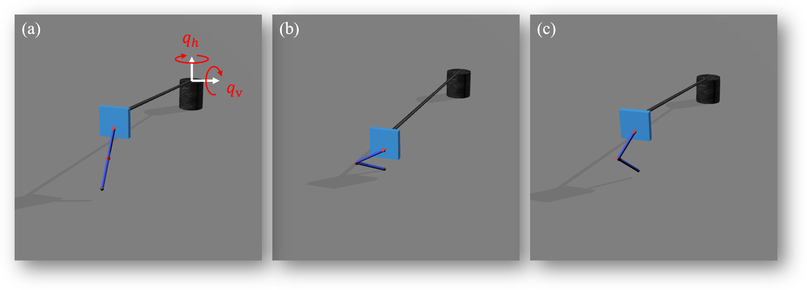
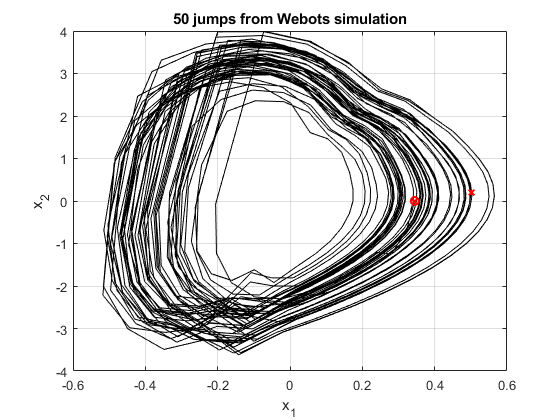
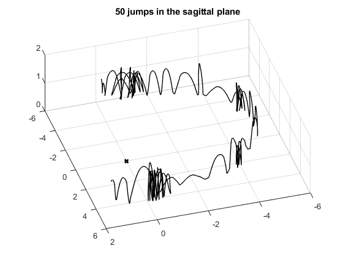

# overconstrained-locomotion
* This is my Undergraduate thesis. This work investegated possible locomotion of an overconstrained leg.
## Bennett's four-bar linkage
This is an exapmle, or the source of our ispiration, of a Bennett's linkage.

 

## Overconstrained leg  
The overconstrained leg is literally half of the four-bar linkage. The first two joints 1 and 2 are chosen to be actuation.  

 

## Controller design through templates composition
We first studied a monopod with overconstrained leg. Its frontal plane and sagittal plane view is shown below:

 

Controlling this monopod jumping in a sagittal plane requires consideration of its foot placement that is not directly underneath the body. $\delta$ here is the angle of projection from leg to YZ plane. The hopping controller is inspired by PennJerboa [1](#penn-jerboa) and some other works [2](#raibert) [3](#BHop) [4](#Analysis).  
## Webots experiments
  
## Results
Here are some initial results of the monopod hopping in the sagittal plane.

  

phase space

sagittal plane trajectories

Some experiments are recorded in 'videos'.
## References

[1] [The Penn Jerboa: A Platform for Exploring Parallel Composition of Templates](https://repository.upenn.edu/ese_reports/16/)

[2] [Legged robot that balance](https://www.amazon.com/Legged-Robots-Balance-Artificial-Intelligence/dp/0262681196)

[3] [Reactive Planning and Control of Planar Spring–Mass Running on Rough Terrain](10.1109/TRO.2011.2178134)

[4] [Analysis of a Simplified Hopping Robot](https://doi.org/10.1177/027836499101000601)